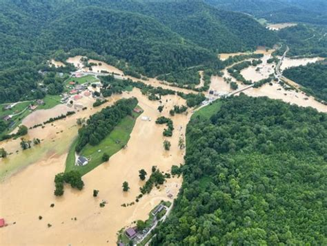
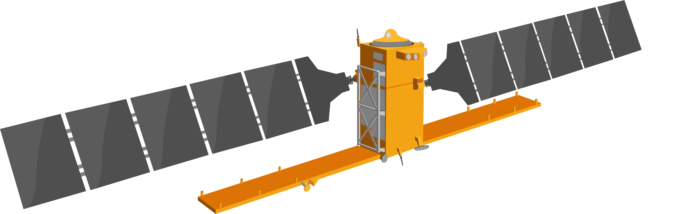
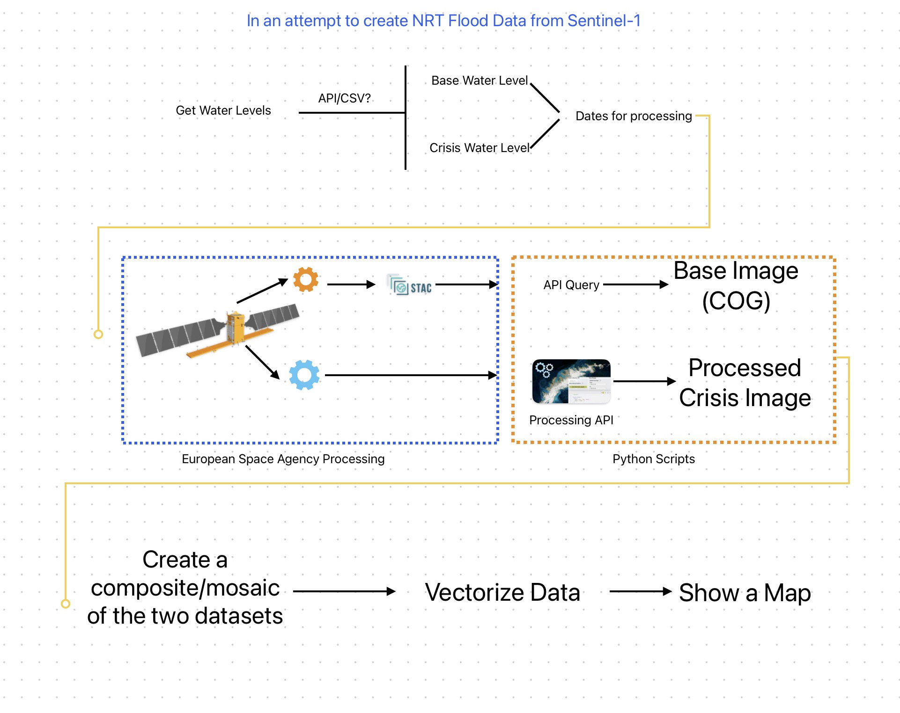

# codeky-capstone-proposal

## Background

Over the past few years, Kentucky has been subjected to extreme weather events.  The tornados in western Kentucky, the floods in southeast Kentucky, and as of this proposal, the floods all over Kentucky. 

 

While Kentucky has a plethora of Geographic Information System (GIS) data, none of that data includes near-real-time (NRT) remote sensing data (i.e., imagery).  *(Note: I'm excluding vector-based GIS data in my definition of NRT data).*  Yes, after a disaster some private companies do fly an area to acquire imagery, but this data is almost always behind a paywall, and if it is released publicly, it will be months, if not years, afterwards.  Furthermore, this data is usually not standardized (georeferencing, cloud cover, etc).  

In addition, it is not uncommon to see use case examples that leverage satellite-based data to analyze flooding effects.  Again, these examples usually appear a long time after the emergency occured.

For this project, I plan to acquire the most recent Sentinel-1 satellite data to show how flooding is having impacts now.  Ultimately, I would like to have a work flow that could be deployed in times of crisis, and have the resulting imagery/data be available for public consumption, but more importantly, for emergency management services.  

</img>
 

Why Sentinel-1?  Because it uses Synthetic Aperture Radar (SAR) technology.  Light passed to the earth from the satellite will create backscatter over flat water surfaces.  SAR can also pass through clouds, unlike visible spectrum imagery.  Hence making it possible to acquire a base image and a crisis image for comparison. 

## Data Acquisition

The European Space Agency (ESA) has many [APIs](https://dataspace.copernicus.eu/analyse/apis) that can be leveraged.  I am most familiar with how a [STAC](https://stacindex.org) works, but I believe this will only result in processed data and would exclude the most recent (last day or so) of collected data.  I will probably have to find *raw*, unprocessed data for the most recent satellite pass to have a more NRT product.

## Data Processing

Sentinel-1 data will have a particular file-naming convention that will need deciphering.  I will need to subset a grid system that makes it easier to determine geographical locations (**WHERE**).  In addition, file names will also contain datetime information that will be used for querying **WHEN** the data was collected.  

#### Finding a baseline

In order to select the appropriate image for download, I will need to analyze USGS Gauge data for water levels.  I expect to do this with an API call and import into dataframe for some simple statistics.  Once a base water level is determined, I'll need to make an API call to Copernicus to query for Sentinel-1 imagery collected around that time.  I believed it will most likely already be a processed image in Cloud-Optimized Geotiff (COG) format. 

#### Finding the most recent image acquisition.

This API call could result in a COG, but more likely an unprocessed [level-1](https://sentiwiki.copernicus.eu/web/s1-processing) image.  This means I will need to perform several process on it just to create a comparable image (remove noise, georeference, etc)

#### Data Product

Once the baseline and crisis images are processed, they can then be merged/stacked and displayed using RGB values.  Assigning different band values to the different products should provide a flood map image.

## Workflow

</img>
 

## Further Exploration

Kentucky recently published a 2-Foot elevation layer.  This is much higher resolution than the SAR data, but it might be worth exploring flood impacts based on actual Kentucky values.  

In addition, vector-based GIS products could be derived.  For example, once an image is created for the flooding, the raster (imagery) data could be converted to vector lines or polygons.  Transforming raster data into vector data will allow for the exploitation of multipe geoprocessing tools (e.g, buffers, intersections, areas).  For example, a flood polygon feature can be geoprocessed to see what locations (houses, schools, roads, etc) overlap.  These can be quick and dirty tools that allow emergency manangement to have calulated data on damage (i.e, asking feds for $$).  

## APIs

 - [Sentinel Hub](https://documentation.dataspace.copernicus.eu/APIs/SentinelHub/Process.html)
 
 - [Iowa Environmental Mesonet](https://mesonet.agron.iastate.edu/api/) - a plethora of weather-related data.  I believe I found USGS Stream Gauge data here before

 - [STAC Catalogue](https://documentation.dataspace.copernicus.eu/APIs/SentinelHub/Catalog.html) - an API for query data by space and time.  

 ## Things to consider

 Although I believe the project will only pull data SAR data files, they may be large in size ~8 gbs.  That's not insanely big, but I'm unsure how long some of the processing will take.  This could require chunking into smaller areas of interest, using multithreading/multiprocessing modules, or a combination of both.

 ## Backup plan

 Use the [Kentucky Elevation Data](https://tiles.arcgis.com/tiles/ghsX9CKghMvyYjBU/arcgis/rest/services/Ky_DEM_KYAPED_Phase2_WM/ImageServer) to create flooding models.  
